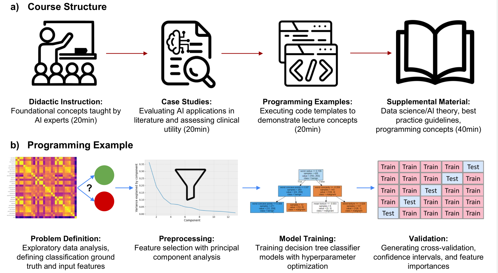

# Introduction to Artificial Intelligence

In May 2022, the Department of Diagnostic Radiology at Queen's University hosted a 3-week introduction to AI workshop. The workshop focuses on developing foundational literacy in AI for diagnostic radiology residents. The curriculum includes didactic lectures designed by a team of AI engineers and staff radiologist, case studies from literature, and programming examples highlighting data processing for AI analysis.

 

The curriculum was designed to follow specific learning objectives to introduce data science definitions, supervised and supervised learning, predictive analysis with machine learning, validation, requirements for clinical deployment, and introduction to modern techniques in deep learning. 

 

All curricular content is available at our online repository, including [learning objectives](https://github.com/Queens-Radiology-Intro-To-AI/Intro-to-AI/blob/master/Curricular%20Content/learning_objectives_and_curriculum.pdf), [lectures](https://github.com/Queens-Radiology-Intro-To-AI/Intro-to-AI/tree/master/Curricular%20Content/Lectures), and [programming examples](https://github.com/Queens-Radiology-Intro-To-AI/Intro-to-AI/tree/master/Curricular%20Content/Programming%20Examples).

 

For interactive programming, you can open our notebook(.ipynb) directly in google Colab from Github repo just changing one tiny thing.

Notebook(.ipynb) url:

(./Images/ipynb_url.png)

Change it to:

(./Images/ipynb_url2.png)

 

Visualization of a) curricular content and b) concepts highlighted in programming examples
 

